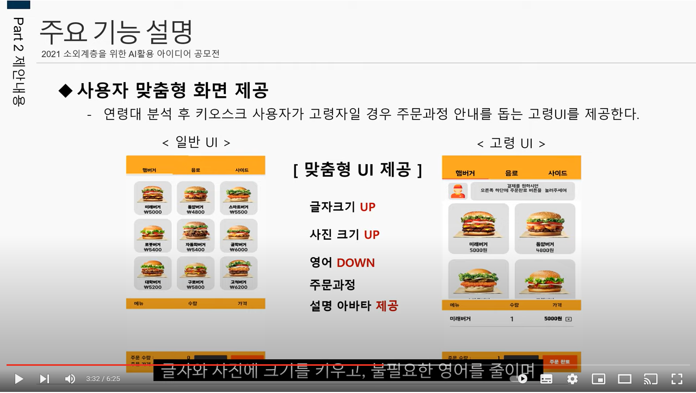

# Universal Design Kiosk
|목록|내용|
|-------|-------|
|담당 Skills & 사용 Libraries| Dart, Firebase, Flutter|
|진행 기간| 2021/03/02 → 2021/07/30|
|팀 구성| App&Data 2명, 인공지능 2명, 기구 1명, 회로 1명|
|한 줄 소개| 키오스크의 확산으로 고령자, 장애인 등 다양한 디지털 소외계층의 어려움을 해소하고자 인공지능을 활용한 사용자 맞춤형 키오스크를 제작하였습니다.|

### 🔗Link


**youtube**

<a href="https://youtu.be/bii_UN2mz7s"></a>

[https://youtu.be/bii_UN2mz7s](https://youtu.be/bii_UN2mz7s)

## 📖 상세 내용

   

  


```

🐷 **SMART**에서 활동하며 2학년 1학기 창의과제기초 프로젝트 입니다. 
음식점, 매표소 등에서 키오스크가 확산함에 따라 이를 쉽게 사용하지 못하는 디지털 소외 계층의 어려움 또한 증가하고 있다. 
이에 휠체어 이용자와 시각 장애인, 노인 등의 디지털 소외 계층 또한 편하게 사용할 수 있는 환경을 마련해주는 유니버설 디자인 키오스크를 만드는 것이 목적이다. 
이를 위해 인공지능을 활용하여 사요자의 연령대를 인식하고 고령자의 경우 맞춤형 UI를 제공한다. 
또한 친숙한 종이주문서를 활용하여 주문할 수 있는 기능을 제공하여 고령층의 키오스크 이용어려움을 줄이려 한다. 키오스크 화면이 높아 이용에 어려움을 겪는 장애인, 어린이를 위해 전방 카메라를 활용하여 자동 높이조절 기능을 제공해 이와 같은 어려움을 해결해 사용자의 이용을 돕는다.

```

## 🛠️ 사용 기술 및 라이브러리
- Flutter, Dart
- OCR
- 얼굴인식 인공지능 
- Firebase Real Time Database, Google assistant
- LinearMotor Contol
- circuit making


## 📱 담당한 기능 (App)

- **메인화면** UI, **상세화면** UI,
- **Firebase 를 활용한 AI 인식 데이터 연동**
- **Google assistant 연동**

## 💡 깨달은 점

- **Github를 활용하여 협업하려고시도함. (다소 어려움)**
- **Firebase (Real Time Database)를 활용하여 CRUD방법 습득**
- **Event Listener, callback 을활용하여 데이터에 따른 상태 업데이트 구현 방법 습득**
